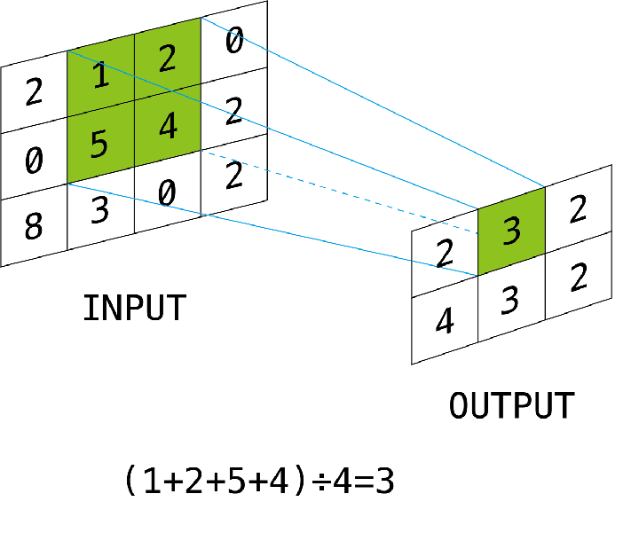

# 卷积操作的计算优化

### 程序描述

给定 一个大小为 (H +  N-1) × (W +  N-1) 的矩阵，经过计算后得到一个 H × W 的矩阵，该 矩阵的每一个元素都是原矩阵以该点为左上角的 N × N 的正方形中的元素的平均值

**输入** : 矩阵的宽度 W 和高度 H 卷积核的大小 N

**输出** : 5种方法进行卷积计算的正确性和消耗时间s

## 优化方法详细描述

### 局部性原理

本程序处理的二维矩阵大小达到10000*10000, 空间规模很大,使用较小的局部变量作为中间变量存储卷积的中间值,利用了cache的高速缓存,减少对内存的IO次数.

程序使用的中间变量大小为W\*(64+N-1)  大概0.6M , 本机CPU的CPU三级缓存大小为6M

### 多线程

使用openMP对程序进行并行化,使用默认的4线程

### SIMD向量指令

使用__m256 也就是 每次处理8个float 数据.主要使用了SIMD的向量加法和乘法.

## 程序的计算方法

由于SIMD提供的向量指令,所以,算法上稍微复杂了点.

基本思路是: 使用一个大小固定的二维矩阵tmp存储中间变量,首先对input 求 行上N个元素的平均值,存储到tmp中,然后对tmp列上连续N个元素求平均值,得到output上特定位置的值.

## 优化结果:

| 使用的方法                 | 消耗的时间 | 内存IO速度 | 加速比 |
| -------------------------- | ---------- | ---------- | ------ |
| 无任何优化                 | 5.1s       | 4.7G/s     | 1      |
| 仅使用多线程               | 1.6s       | 15G/s      | 3      |
| 仅使用局部性原理           | 1.0s       | 3.4G/s     | 5      |
| 局部性原理+多线程          | 0.4s       | 7.4G/s     | 13     |
| 局部性原理+向量指令        | 0.17s      | 19.3G/s    | 30     |
| 局部性原理+向量指令+多线程 | 0.19s      | 17.5G/s    | 27     |

### 优化结果分析

需要处理的数据规模

input 10000*10000\* 4B= 380MB

output 380M

无优化 的内存IO规模: 380*64+380 = 24700M  IO速度 24700M  /5.3s = 4.7G/s

仅使用多线程 IO 规模 24700M  IO速度 24700M/1.6s=15G/s

仅使用局部性原理的内存IO规模:  380*8+380 = 3420M IO速度 3420M/1.0s = 3.42G/s

局部性原理+多线程 的内存IO规模 3420M   IO速度 3420M/0.4s = 7.4G/s

局部性原理+向量指令内存IO规模 3420M  IO速度 3420M/0.156 =  19.3G/s

局部性原理+向量指令+多线程内存IO规模 3420M  IO速度 3420M/0.173 = 17.5G/s

无任何优化的写法的内存IO次数很大,是使用局部性原理的IO规模7倍,消耗的时间是5倍,局部性原理大大减少了内存IO次数,提供了5倍的时间加速.

仅使用多线程优化 内存IO次数也很大,但多线程进行IO调用,使得内存的IO速度达到很高的值,计算速度达到3倍加速.

在使用局部性原理的前提下,使用多线程(4线程),时间消耗减少了60%,多线程的速度达到单线程的2.5倍.

在使用局部性原理的前提下,使用向量指令 的速度是不使用向量指令的6.7倍,而且内存IO速度达到19.3G/s,达到了内存IO速度的极限.

在利用局部性原理和向量指令的前提下,再使用多线程并没有实现加速.原因是内存IO速度已达上限,限制了多线程的加速效果.

## 结论

最优的加速方法是 利用局部性原理 和 向量指令进行卷积操作. 速度达到了无任何优化的30倍! 并且已达到内存IO的极限.

仅使用局部性原理和4线程的做法达到了 13倍 的加速 , 已经达到了很高的加速比.

局部性原理,多线程,向量指令 都在卷积操作上达到了至少3倍的加速,组合的加速比受限于内存的IO速度.利用cache减少IO次数和使用向量指令提高IO速度是卷积操作性能优化最重要的策略.

### 编程环境

Visual Studio 2017 

启用openMP支持

启用增强指令集  高级矢量扩展 2 (/arch:AVX2)

使用预编译头 "pch.h"

### 程序运行方式

直接编译运行,程序会随机生成一个10000*10000大小的浮点矩阵,卷积核默认设置为8\*8大小.

之后,程序会运行不同的卷积版本,并输出各个版本运行的正确性和运行时间.

void solve_no_paralle		// 使用一个较小的临时二维矩阵,无多线程优化

void solve_paralle			// 使用一个较小的临时二维矩阵,使用openMP 4线程运行

void solve_vec				// 使用一个较小的临时二维矩阵,无多线程,使用了SIMD向量指令

void solve_parall_vec	//  使用一个较小的临时二维矩阵,使用openMP 4线程运行,使用了SIMD向量指令

void solve_naive		// 最简单的实现,直接进行卷积,无任何优化

### 库函数依赖

\#include <immintrin.h>

\#include <omp.h>